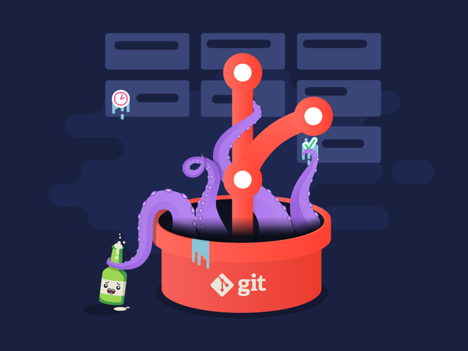

# Guia de Contribuição

Bem-vindo à Vila Dev! Agradecemos seu interesse em contribuir para nossos projetos privados. Sua colaboração é fundamental para o sucesso de nossos empreendimentos tecnológicos. Antes de começar, por favor, leia e siga este guia para garantir um processo de contribuição suave.



## Fluxo de Contribuição

1. **Criação de Issues:**
   - Antes de iniciar qualquer trabalho, entre em contato com o responsável pelo projeto para discutir a proposta de contribuição.
   - Somente após aprovação, crie uma *issue* no repositório privado descrevendo o problema ou a melhoria proposta.

2. **Desenvolvimento:**
   - Receba permissões de acesso ao repositório privado.
   - Crie uma branch específica para a sua contribuição (por exemplo, `feature/nome-da-feature`) diretamente no repositório principal.
   - Realize as alterações e mantenha o código limpo e legível.
   - Certifique-se de seguir as diretrizes de estilo de código do projeto.

3. **Testes:**
   - Certifique-se de que seus changes são testados adequadamente.
   - Adicione testes sempre que aplicável.

4. **Pull Request:**
   - Abra um *pull request* para a branch principal do repositório.
   - Forneça uma descrição detalhada das alterações realizadas.
   - Lembre-se de referenciar a *issue* associada ao seu *pull request*.

5. **Revisão de Código:**
   - Aguarde a revisão do seu *pull request* pela equipe da Vila Dev.
   - Esteja disposto a realizar ajustes conforme solicitado durante a revisão.

6. **Merge:**
   - Uma vez aprovado, seu *pull request* será mergeado pela equipe da Vila Dev.


## Git Workflow
Utilizamos o [GitHub Flow](https://guides.github.com/introduction/flow/) como fluxo de trabalho para o desenvolvimento de novas funcionalidades e correção de bugs.
Este fluxo de trabalho garante a entrega contínua de novas funcionalidades e correções de bugs, além de facilitar a colaboração entre os membros da equipe.

### Branches

- `main`: branch principal do repositório. Contém o código em produção.
- `feature/*`: branches de desenvolvimento de novas funcionalidades.
- `fix/*`: branches de correção de bugs.


### Commits
Utilize o padrão [Conventional Commits](https://www.conventionalcommits.org/en/v1.0.0/) para nomear seus commits. Exemplo:

```
feat: add new feature

Add new feature to the project

BREAKING CHANGE: this commit breaks the API
```

## Diretrizes de Estilo de Código

Nossos projetos adotam formatação automática com Prettier e ESLint. Ao contribuir, certifique-se de alinhar seu código com essas ferramentas para garantir uma padronização consistente e facilitar a colaboração. Evite configurações manuais de formatação, uma vez que essas ferramentas automatizam esse processo.

## Diretrizes Gerais

- Contribua de forma construtiva e respeitosa.
- Mantenha a confidencialidade de informações sensíveis relacionadas a projetos privados.
- Reporte qualquer comportamento inadequado ou violação das políticas internas diretamente à equipe da Vila Dev.

Ao contribuir para projetos da Vila Dev, você concorda em seguir estas diretrizes. Agradecemos sua colaboração e esperamos construir soluções incríveis juntos!