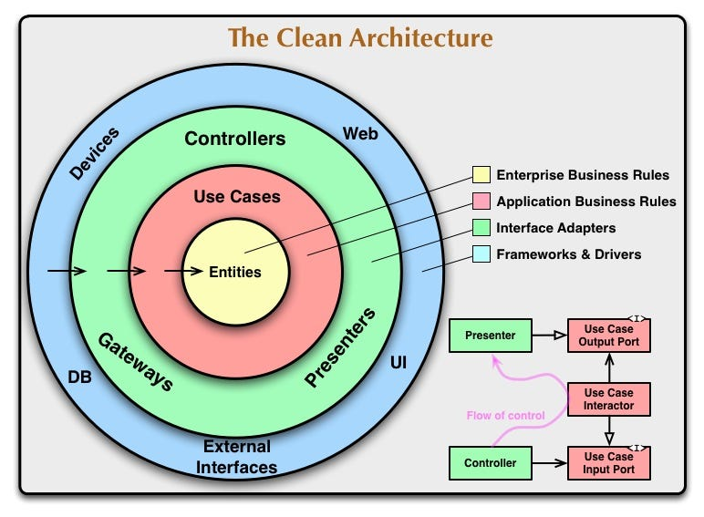

# Entendendo decisões arquiteturais e a estrutura do projeto
O OmniTalkHub é um mono-repositório que utiliza NPM workspaces para gerenciar os projetos. Escolhemos essa abordagem para facilitar o desenvolvimento e a colaboração entre os membros da equipe.

Cada projeto é um pacote NPM e pode ser publicado individualmente.

## Estrutura do projeto
📂 OmniTalkHub  
┣ 📂 packages  
┃ ┣ 📂 [api]()  
┃ ┣ 📂 [web]()  

## API
A API é responsável por gerenciar os dados do projeto. Ela é construída com Node.js, Express e PostgreSQL e utiliza o ORM Prisma para realizar a conexão com o banco de dados.
Optamos por aplicar o padrão de arquitetura Clean Architecture para organizar o código da API. Essa abordagem nos permite separar as responsabilidades do projeto em camadas, facilitando a manutenção e a evolução do código.

Cada módulo do projeto é organizado em uma camada específica, conforme ilustrado abaixo:

A [API]() foi projetada com suporte a multitenancy, o que significa que é preparada para atender a múltiplos inquilinos (tenants). Essa capacidade permite que diferentes clientes ou usuários compartilhem a mesma instância da aplicação, mantendo seus dados isolados. Essa abordagem é valiosa em ambientes onde há a necessidade de suportar várias organizações ou clientes usando a mesma infraestrutura.

Para mais informações sobre a estrutura do projeto, consulte o STRUCTURE.md da [API](packages/api/STRUCTURE.md).

## WEB
Também projetada com suporte a multitenancy, a aplicação web é responsável por gerenciar a interface do projeto. Ela é construída com React e Next.js e utiliza o Material UI como framework de UI. Para o gerenciamento de estado, utilizamos o Redux Toolkit.

Tomamos a decisão de utilizar um tema pronto para agilizar o desenvolvimento da interface. O Material UI oferece um conjunto de componentes e estilos que facilitam a criação de interfaces consistentes e bonitas. o tema escolhido foi o [modernize-next-js](https://drive.google.com/file/d/1Pyd73Ypo4c3UgyZ7iQMlZBmRD1qeuXz9/view?usp=sharing).

Para mais informações sobre a estrutura do projeto, consulte o STRUCTURE.md da [WEB](packages/web/STRUCTURE.md).

## Estrutura de Dados
Optamos por utilizar o PostgreSQL como banco de dados principal do projeto, uma vez que ele oferece suporte nativo a multitenancy, alem de ser um banco de dados relacional robusto e confiável.

O banco de dados é composto por 3 schemas: `public`, `tenant` e `tenant_template`.

O schema `public` é responsável por armazenar os dados do sistema, como usuários, organizações e configurações globais.

Os schemas `tenant` e `tenant_template` são utilizados para armazenar os dados de cada inquilino (tenant). O schema `tenant_template` é utilizado como modelo para criação de novos tenants. Ele contém as tabelas e os dados que serão replicados para cada novo tenant criado.

## Autenticação
A autenticação é gerenciada pelo serviço Keycloak, que é um servidor de identidade open source baseado em OAuth 2.0. Ele é utilizado para gerenciar usuários, grupos e permissões de acesso ao sistema. Todos os serviços do projeto são integrados ao Keycloak para autenticação e autorização.

Tomaos a decisão de utilizar o Keycloak para gerenciar a autenticação e a autorização do projeto por ser uma solução robusta e confiável, além de oferecer suporte nativo a multitenancy, eliminando a necessidade de implementar essa funcionalidade manualmente, o que reduz o tempo de desenvolvimento e facilita a manutenção do código.

# Expansão sobre Multitenancy:
A estrutura da API foi projetada para oferecer suporte eficiente ao multitenancy, permitindo que diferentes inquilinos compartilhem a mesma instância da aplicação. Abaixo estão os principais pontos relacionados ao multitenancy na API:

- **Isolamento de Dados:**  
Cada inquilino possui seu próprio esquema no banco de dados, representado pelo schema tenant. Isso garante que os dados de um inquilino sejam completamente isolados dos dados de outros inquilinos.

- **Template de Inquilino:**  
Utilizamos o esquema tenant_template como modelo para criar novos inquilinos. Esse esquema contém as tabelas e dados padrão que serão replicados para cada novo inquilino, garantindo uma consistência estrutural.

- **Conexão Dinâmica ao Banco de Dados:**  
implementamos uma lógica de conexão dinâmica ao banco de dados, permitindo que a API se conecte automaticamente ao esquema apropriado com base no inquilino que está sendo acessado. Isso é crucial para garantir que cada solicitação seja direcionada aos dados do inquilino correto.

- **Middleware de Autenticação Multitenancy:**  
Integramos um middleware de autenticação na API para garantir que as solicitações sejam associadas ao inquilino correto. Esse middleware verifica a identidade do inquilino com base em informações fornecidas durante o processo de autenticação.

## Aplicação Web
A aplicação web também foi concebida para suportar multitenancy de maneira eficiente. Aqui estão os aspectos fundamentais relacionados ao multitenancy na aplicação web:

- **Roteamento Dinâmico:**  
Implementamos um sistema de roteamento dinâmico na aplicação web para lidar com diferentes inquilinos. Cada inquilino tem sua própria rota base, garantindo que a navegação e o estado da aplicação sejam específicos para cada contexto.

- **Integração com Serviços Multitenancy:**  
A aplicação web se integra de forma transparente aos serviços fornecidos pela API, garantindo que as solicitações e operações estejam alinhadas com o contexto do inquilino em execução.